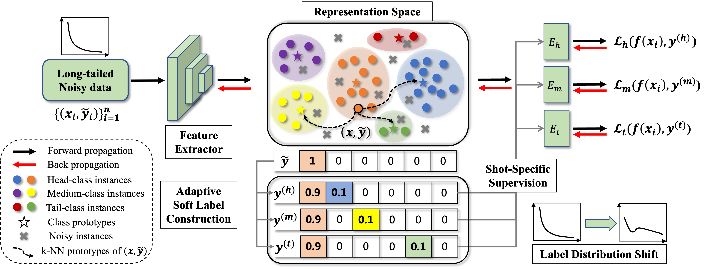
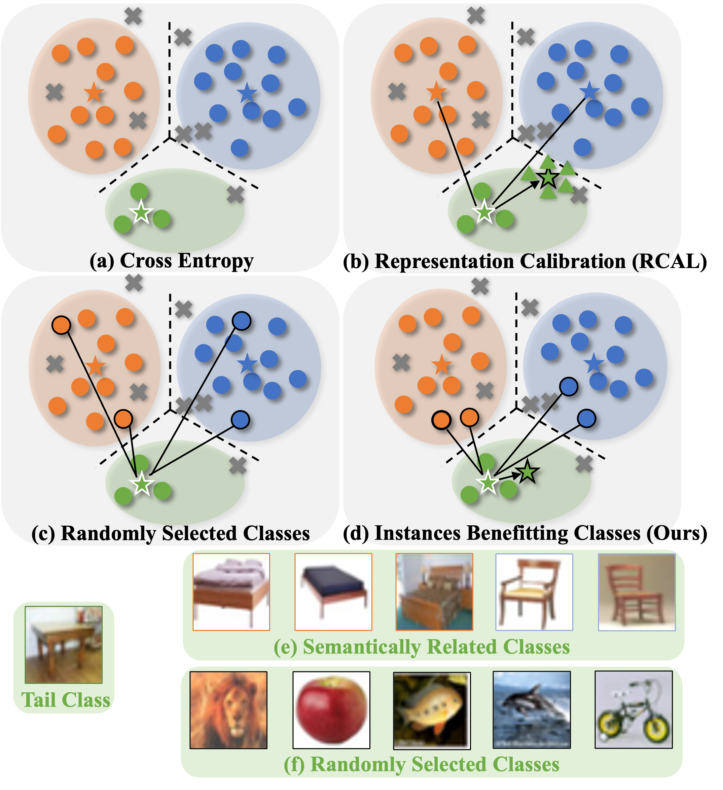
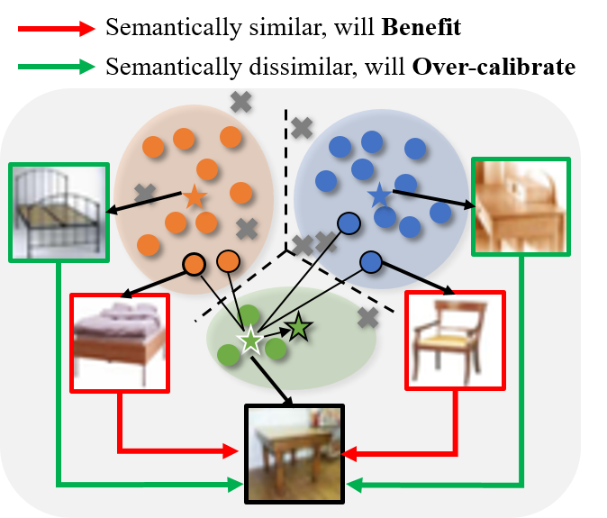

# [ICCV'25] Boosting Class Representation via Semantically Related Instances for Robust Long-Tailed Learning with Noisy Labels

[[paper](https://drive.google.com/file/d/12MeqX-5E57OwU_x5EWls77ttV7b1Nm80/view?usp=sharing)], [[poster (to be updated)]]

This repository is the official PyTorch implementation for the **ICCV 2025** paper "Boosting Class Representation via Semantically Related Instances for Robust Long-Tailed Learning with Noisy Labels", its method named **IBC**. This repository includes several baseline methods in Long-Tailed Noisy Label Learning.

<b>Title</b>: <i>Boosting Class Representation via Semantically Related Instances for Robust Long-Tailed Learning with Noisy Labels</i>

<b>Illustration</b>
<p align="center">
  
</p>
<p align="left">
  
  
</p>

## Contents
- [IBC](#Boosting-Class-Representation-via-Semantically-Related-Instances-for-Robust-Long-Tailed-Learning-with-Noisy-Labels)
  - [1. Abstract](#1-abstract)
  - [2. Requirements](#2-requirements)
  - [3. Experiments with IBC](#3-experiments-with-ibc)
  - [4. Citation](#4-citation)
  - [5. Reference](#5-reference)
  - [6. Contact](#6-contact)

## 1. Abstract
The problem of learning from long-tailed noisy data, referred to as Long-Tailed Noisy Label Learning (LTNLL), presents significant challenges in deep learning. LTNLL datasets are typically affected by two primary issues: class imbalance and label noise. While previous methods have addressed these problems separately, the simultaneous presence of both in real-world applications remains underexplored. In this paper, we introduce a simple yet effective method, **I**nstances **B**enefitting **C**lasses (IBC). Our philosophy is to simultaneously overcome overfitting to noisy classes and transfer knowledge between semantically related classes. At the instance level, we propose selecting top-$k$ semantically similar classes and use them to construct soft labels. Specifically, we soften noisy hard labels by reducing the probability of noisy classes and reallocating this probability to the semantically similar classes. **This reduces the model's overconfidence in noisy classes while enhancing its focus on tail classes.** We next propose a novel shot-specific multi-expert ensemble learning framework to make knowledge transfer more targeted, where we maintain multiple shot-specific soft labels for each instance, with each expert supervised by one of these labels. By integrating these experts, we demonstrate that IBC exhibits more separable representations, improving both overall and partition performance. Extensive experiments show that IBC outperforms existing state-of-the-art (SOTA) methods on a variety of benchmark and real-world datasets, achieving improvements ranging from **1.89%** to **4.99%** on the CIFAR-10 and CIFAR-100 datasets across all settings.

## 2. Requirements
The code requires `python>=3.7` and the following packages.
```
numpy==1.24
torch==1.13.0
torchvision==0.14.0
faiss==1.7.4
scikit-learn=1.3.0
```
These packages can be installed directly by running the following command:
```
pip install -r requirements.txt
```
Note that all the experiments are conducted under one single <b>RTX 4090</b>, so the results may be a little different with the original paper when you use a different gpu.

## 3. Experiments with IBC

### 3.1 Datasets

This code includes five datasets including:
CIFAR-10, CIFAR-100, WebVision, Clothing1M, Tiny-ImageNet.

|Datasets|Download links|
| --------- | ---- |
|CIFAR-10|[link](http://www.cs.toronto.edu/~kriz/cifar-10-python.tar.gz)|
|CIFAR-100|[link](http://www.cs.toronto.edu/~kriz/cifar-100-python.tar.gz)|
|WebVision|[link](https://data.vision.ee.ethz.ch/cvl/webvision2018/val_images_resized.tar)|
|Clothing1M|[link](https://opendatalab.com/OpenDataLab/Clothing1M/tree/main)|
|Tiny-ImageNet|[link](http://cs231n.stanford.edu/tiny-imagenet-200.zip)|

If you want to run one of the datasets, please <span style="color:#0099be">download it into your data directory and change the dataset path in python scripts (see the following section)</span>.

### 3.3 Directory settings
Please create the data directories as below and change the parameter `data-dir` in ([./main.py](./main.py)).
```
PLNL
├── data-dir
│   ├── cifar-10-batches-py
│   │   ├── data_batch_1
│   │   ├── data_batch_2
│   │   ├── data_batch_3
│   │   ├── data_batch_4
│   │   ├── data_batch_5
│   │   ├── batches.meta
│   │   └── test_batch
│   ├── cifar-100-python
│   │   ├── file.txt~
│   │   ├── meta
│   │   ├── test
│   │   └── train
│   ├── cifar-100-python.tar.gz
│   ├── cifar-10-python.tar.gz
│   ...
├── Train_longtailed_noisy_cifar.py
...
```

### 3.2 Reproduce the results of IBC
In order to reproduce the results of IBC, you need to change the hyper-parameters in the bash scripts ([./experiments/run.sh](./experiments/run.sh)) as follows.

```bash
#!/bin/bash
Method="Train_longtail_noisy_cifar"
datasets=("cifar10")
noise_ratios=(0.5)
imb_ratios=(0.005)
gpus=(2 2 4 7)
index=0
epsilon=0.1
k=0.25


for dataset in "${datasets[@]}"; do
    for noise_ratio in "${noise_ratios[@]}"; do
        for imb_ratio in "${imb_ratios[@]}"; do
            gpu=${gpus[$index]}
            index=$(( (index + 1) % ${#gpus[@]} ))
            file_path="./results/${Method}/${dataset}_imb${imb_ratio}_nr${noise_ratio}_ep${epsilon}_k${k}.log" 
            log_dir=$(dirname "${file_path}")
            mkdir -p "${log_dir}"
            nohup python -u ${Method}.py --epsilon ${epsilon} --k ${k} \
            --dataset ${dataset} --noise_ratio ${noise_ratio} --imb_factor ${imb_ratio} \
            --gpuid ${gpu} > ${file_path} 2>&1 &
        done
    done
done
```
For example, the above provides how to run the results of IBC on CIFAR-10 with 0.5 noise ratio and 0.005 imbalance ratio, please change the value of `data_dir` as yours and run the following command:
```shell
cd IBC
bash ./experiments/run.sh
```

## 4. Citation
If you find our work useful for your research, please use the following BibTeX entry. Thank you very much!
```
@inproceedings{
  li2025boosting,
  title={Boosting Class Representation via Semantically Related Instances for Robust Long-Tailed Learning with Noisy Labels},
  author={Yuhang Li and Zhuying Li and Yuheng Jia},
  booktitle={Proceedings of the IEEE/CVF International Conference on Computer Vision},
  year={2025},
}
```

## 5. Reference
This codebase refers to DISC[[link](https://github.com/JackYFL/DISC)], SFA [[link](https://github.com/HotanLee/SFA)], thank you!

## 6. Contacts
If you have any further questions, please feel free to send an e-mail to: yuhangli@seu.edu.cn.

## License
This repo is licensed under MIT License.
